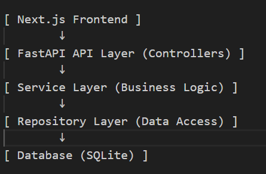
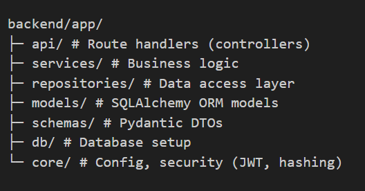
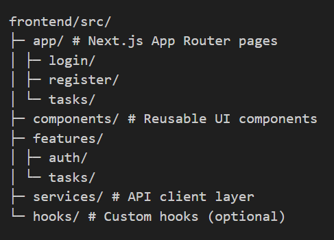
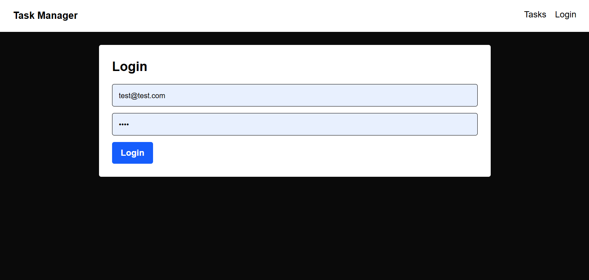
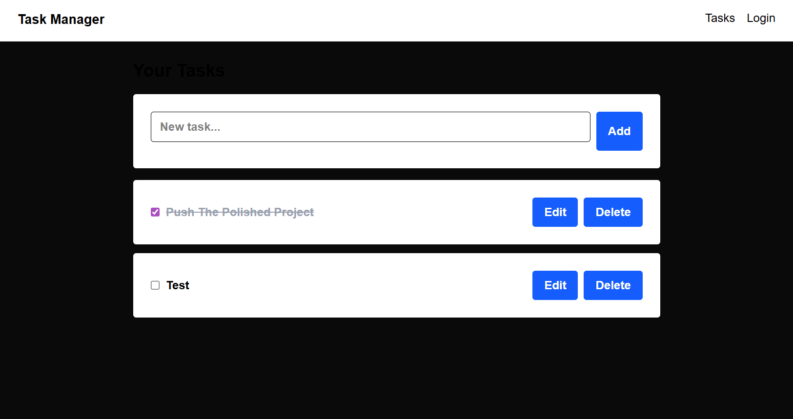

# Fullstack Demo Task Manager

A modern full-stack task management application demonstrating clean architecture, separation of concerns, and scalable design patterns across both frontend and backend systems.

---

## Architecture Overview

This project follows a layered architecture:



---

## Tech Stack

### Backend
- FastAPI
- SQLAlchemy
- Pydantic
- JWT Authentication (python-jose, passlib)

### Frontend
- Next.js (App Router)
- TypeScript
- Axios
- Tailwind CSS

---

## Features

### Authentication
- User registration
- Login with JWT
- Protected routes (client-side)

### Task Management
- Create tasks
- View tasks
- Update tasks (title + completion toggle)
- Delete tasks

### UI/UX
- Clean component-based UI
- Inline task editing
- Loading states and basic validation

---

## Project Structure

### Backend



---

### Frontend



---

## Design Patterns Used

### Repository Pattern
Encapsulates database operations and isolates persistence logic.

### Service Layer
Handles business logic and orchestrates repository calls.

### Dependency Injection
Implemented using FastAPI's `Depends` for loose coupling.

### DTO Pattern (Schemas)
Separates internal database models from API contracts.

### Frontend Service Layer
Abstracts API calls away from UI components.

---

## API Examples

### Register User


POST /users


```json
{
  "email": "test@example.com",
  "password": "password123"
}

```
Login
POST /auth/login

```json

{
  "access_token": "...",
  "token_type": "bearer"
}

```
Create Task
POST /tasks

Authorization: Bearer <token>

```json
{
  "title": "New Task"
}

```
Update Task
PUT /tasks/{id}

```json
{
  "title": "Updated Task",
  "completed": true
}

```
Delete Task
DELETE /tasks/{id}

## How to Run
1. Backend
```
cd backend

python -m venv .venv
.venv\Scripts\activate  # Windows

pip install -r requirements.txt

uvicorn app.main:app --reload

Backend runs on:

http://127.0.0.1:8000

Docs:

http://127.0.0.1:8000/docs
```

2. Frontend
```
cd frontend

npm install
npm run dev

Frontend runs on:

http://localhost:3000
```

## Key Design Decisions
### Why FastAPI?
- High performance
- Built-in dependency injection
- Strong typing via Pydantic
### Why Next.js?
- File-based routing
- Modern React patterns (App Router)
- Strong developer experience
### Why SQLite?
- Zero setup
- Ideal for local development and demos

This project demonstrates:

Clean backend architecture (layered + DI)
Structured frontend with separation of concerns
Full JWT authentication flow
Complete CRUD functionality

---

## 3 High-Impact Optional Additions

## UI Preview

### Login Page


### Tasks Page


### Demo


## What I Would Improve With More Time

- Server-side auth protection (middleware)
- Optimistic UI updates
- Test coverage (backend + frontend)